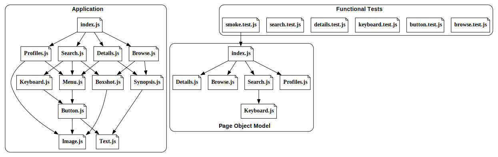
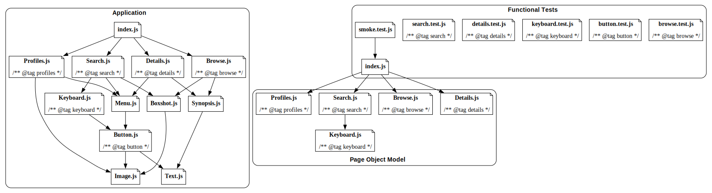
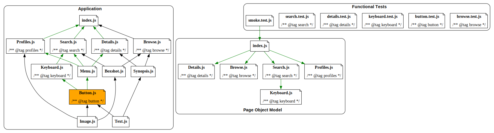

# Find Related (Functional) Tests

## Context

Testing can be broadly split into two buckets: open-box and closed-box tests.

Unit tests are "open-box" tests, they import a piece of code and place expectations and assertions on its behavior. The
static import of the code under test makes it very easy to find related tests using a dependency graph. In fact, Jest
provides a CLI parameter for exactly this use-case: `--findRelatedTests` ([documentation](https://jestjs.io/docs/29.0/cli#--findrelatedtests-spaceseparatedlistofsourcefiles)).

Functional tests are "closed-box" tests, they do _not_ import code directly making it impossible to connect a change set
to a list of related functional tests.

## Connecting the dots

This library aims to connect the dots between code changes and functional tests.
It does this by building a dependency graph, like shown below:



As you can see, there is an application built of files that have dependencies on
each other. There are functional tests (which we know do _not_ have a dependency
on the application), some of which may make use of a Page Object Model (POM) to
help model how to programmatically interact with the application.

We begin by adding a [docblock](https://en.wikipedia.org/wiki/Docblock) to the
top of any application file we're interested in functionally testing. We could
start with just the top-level routes, but these could be anywhere in the
application we want.

```ts
/**
 * @tag search
 */
```

We can also add tags to the functional test files to specify which "tags" we're
testing. Here's an example of how we could annotate our example application:



Notice that we don't need to annotate every file.

OK, it's time to put this into action.

Let's say that a developer makes a change to `Button.js`. The library will build
an _inverse_ dependency graph, and collect tags from all dependent files (as
well as the tags specified in `Button.js`).



By following the inverse dependencies from `Button.js`, we can see that it is
used in `Keyboard` and `Menu`, and those components are used in `ProfileGate`,
`Search`, and `MDP`. This results in these tags:

```ts
['button', 'details', 'keyboard', 'profiles', 'search'];
```

We can use these to find all tests which contain any of these tags. For our
change to `Button.js`, this will be:

```ts
['button.test.js', 'details.test.js', 'keyboard.test.js', 'search.test.js', 'smoke.test.js'];
```

Notice that `smoke.test.js` is included – this is because we use the dependency
graph to associate tags with tests. This enables us to implicitly tag tests when
we use shared libraries, such as the Page Object Model.

## Usage

```sh
$ npm install @cameronhunter/find-related-tests
```

You can use this as a library:

```ts
import { Project } from '@cameronhunter/find-related-tests';

const project = new Project('jest.config.js');

const changedFiles = ['application/components/Button.js'];

const relatedTests = await project.findRelatedTests(changedFiles);
```

Or as a CLI:

```sh
$ find-related-tests --config jest.config.js --file application/components/Button.js
application/__functional__/button.test.js
application/__functional__/details.test.js
application/__functional__/keyboard.test.js
application/__functional__/search.test.js
application/__functional__/smoke.test.js
```
